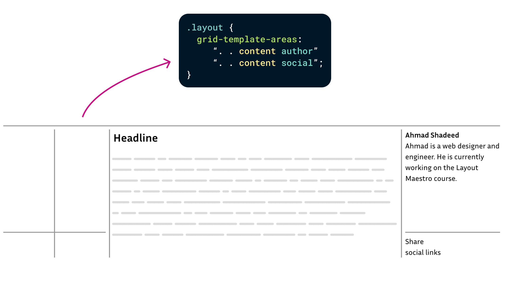
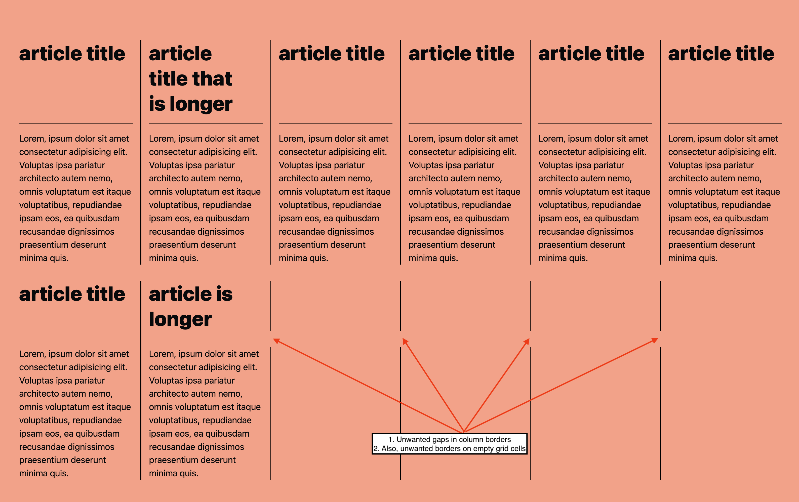
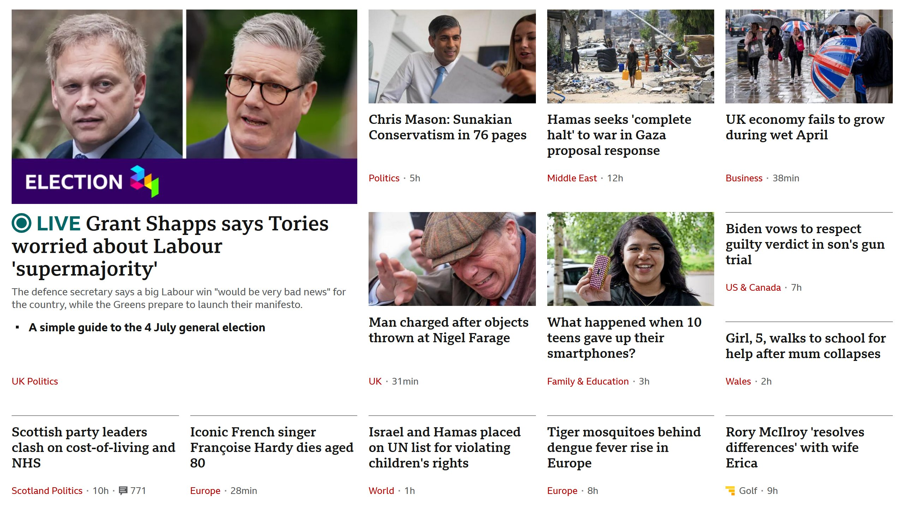

# Gap Decoration Visibility

```css
column-rule-visibility-items: [ all | around | between | none | [ start-side || end-side ] ]
row-rule-visibility-items:    [ all | around | between | none | [ start-side || end-side ] ]

column-rule-visibility-self: [ auto | around | between | none | [ start-side || end-side ] ]
row-rule-visibility-self:    [ auto | around | between | none | [ start-side || end-side ] ]
```

`rule-visibility-items` sets the default behavior for the container. `all` is the initial value and current behavior: paint decorations in all gaps regardless of whether items are present.

`rule-visibility-self` overrides the container default behavior for a specific item. `auto` is the initial value; it defers to the default behavior set for the container.

On either property:
- `around` includes decorations in gaps adjacent to at least one item
- `between` includes decorations in gaps adjacent to two items only
- `none` includes no decorations
- `start-side` includes a decoration on the start side only (block start for row decorations, inline start for column decorations)
- `end-side` includes a decoration on the end side only (block end for row decorations, inline end for column decorations)

## Examples



```css
.layout {
  rule: 1px solid gray;
  rule-visibility-items: around;
}
```

-----


```css
.container {
  column-rule: 1px solid white;
  column-rule-visibility-items: between;
}
```

-----



```css
section {
  column-rule: 2px solid black;
  column-rule-width: 2px 1px;
  rule-visibility-items: around;
}
```

-----

Interestingly, all of the above examples are solvable without `-self`.

But consider the [BBC layout](https://github.com/w3c/csswg-drafts/issues/10393#issuecomment-2164034565):



That calls for horizontal lines that align with adjacent content, so it's better suited to borders than gap decorations. However, a variant calling for the decorations in the gaps of non-image cards only might be achieved using something like:

```css
.container {
  row-rule: 1px solid gray;
  row-rule-visibility-items: none;
}
.non-image-card {
  row-rule-visibility-self: start-side;
}

```

